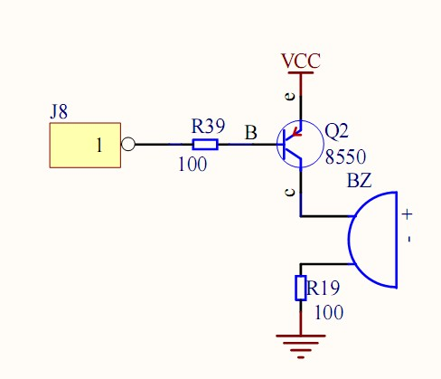
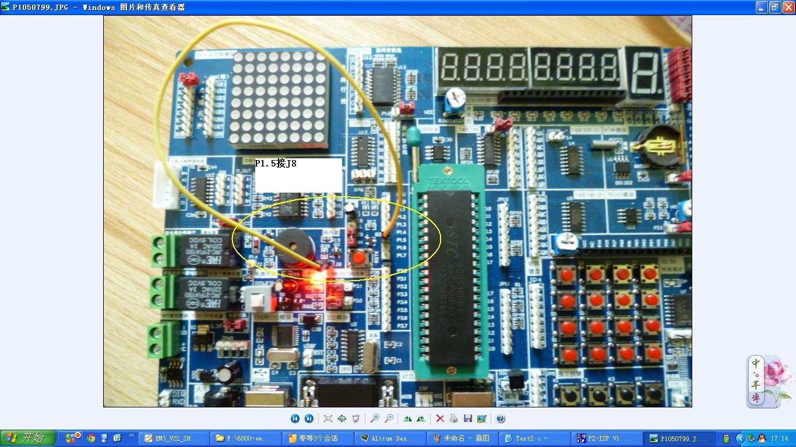

# 蜂鸣器

电路原理图

实际接线图

pin针脚与蜂鸣器的唯一接脚相连，PIN针脚由代码决定。

## 八月桂花

## 嘀嘀

## 救护车

## 无源蜂鸣器

响->静交互，产生电报滴答的效果。（测试完成）

## 测试

测试程序，用于判断是否正常工作。（测试完成）

<a href="https://feater.top/embedded/c51/167/">Linux下C51开发1：蜂鸣器</a>

## 生日快乐

## 祝你平安

