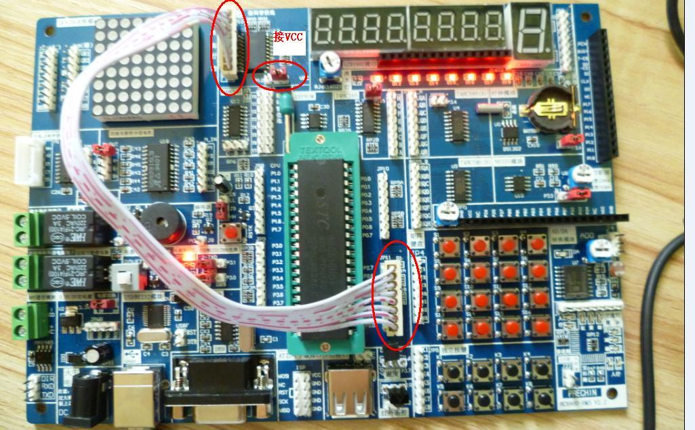
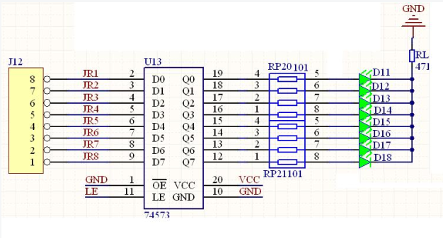

# LED

接线图：

JP11（P2口）和J12用8PIN排线连接起来
在开发板上找到相应的文字标示。

电路图：

## LED闪烁

c语言代码测试完成

<a href="https://feater.top/?p=216">Linux下C51开发2：LED</a>

## 二进制加法

C语言代码测试完成

## 流水灯

C语言代码测试完成

## 跑马灯

C语言代码测试完成

## 左右跑马灯

C语言代码测试完成

## 中断方式闪烁
